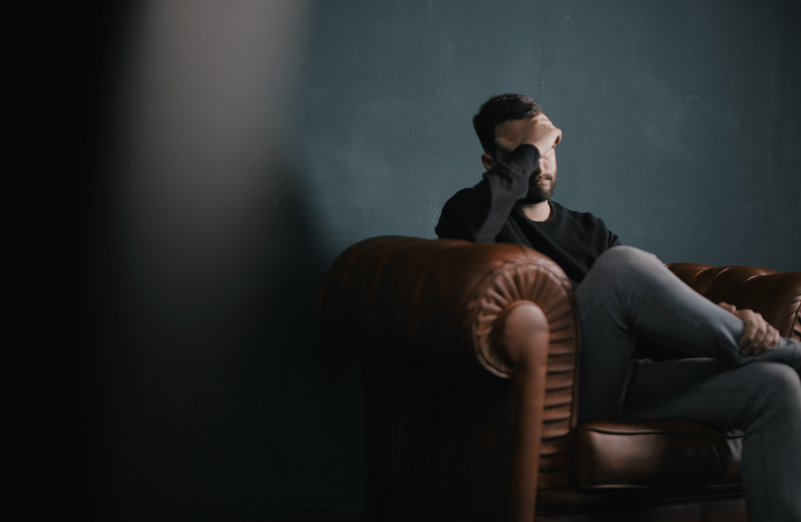

The only way to describe the events of the past month… *Madness*.  

In just the last four weeks, our daily lives have changed in a way that none of us could have anticipated. Although the awareness of COVID-19 came before March, for a lot of people they were not directly affected by it until this month. It’s probably right to assume that no expected it to grow this rapidly across the globe. 

It’s completely changed how businesses, healthcare and how whole countries operate. We’ve seen several countries across the global enter into a national lockdown to prevent further spread of the disease and seen the number of fatalities rise every single day. 

In the UK alone, there have been 19,522 cases where 1,228 had resulted in a fatality. People all over the world are losing loved ones every single day and I send all my love, support and prayers to everyone through this very difficult time. 

In order to prevent this spread in the UK and globally, we all need to take responsibility for our own behaviour and actions over the coming months as this will be crucial to prevent many more cases and fatalities. This isn’t a blog post about urging to stay inside because I know that so many of you are respecting the rules - but please be mindful in your actions now more than ever. 

# The Company Culture Impact 

Due to the importance of social distancing to prevent the spread, many businesses have had to adopt a working from home policy at scale that no one had anticipated sometimes with little/no preparation time to implement the right tools. 

To some, they may have never worked from home and the adjustment to this new normal may be a very difficult transition. Many people rely on the company culture as a way to motivate and keep positive during the working week. 

We’re in a world of uncertainty right now with no view of when this might all be over, but one thing that we do know for sure - there is no going back to normal, because this is our new normal. 

Although businesses are likely to have some teething problems with this new change, it could ultimately be a very positive experience if handled in the right way. This will be a true test of company culture and an organisations ability to adapt and drive new innovative ways to interact with colleagues and customers. 

*[Photo by Austin Distel on Unsplash](https://unsplash.com/@austindistel)*

For example, I work for William Hill - one of the largest bookmakers in the UK. The senior leadership took very quick and decisive action as the impact of COVID-19 became clear and we have been working from home for over two weeks. 

It hasn’t been a walk in the park, but no one ever expected it to be - it’s an unprecedented time with everyone having to adapt simultaneously to help drive and move the business forward. 

You realise very quickly the things that you take for granted working in an office, rolling over to your colleagues desk to ask a question or getting them to take a quick glance at your code. Even down to the non-related work stuff, as grabbing a quick coffee or playing a quick round of pool. Although it may not be easy to just jump in and do those things, there are solutions to help your team feel more engaged. 

We’ve utilised video conferencing & slack integrations as an important part of retaining culture whether through coffee meetings, quiz games and many other forms of fun things to get us through the week. 

No one expects you to be 100% productive all day every day whilst we navigate this time, but be innovative in the way you engage with your team and customers. Ultimately, this will offer a big change in the way companies operate moving forward and forced many companies who were against remote working to the pros/cons of the practice. 

# Attitude of Gratitude 
I am truly appreciative of how lucky I am right now. Unlike many others, I am in a fortunate position where I have a food over my head, access to amenities and an incredible healthcare system in place should there be any necessity to you use. I have a job that has enabled me to adapt to remote working and a support system both at work and home that has made this transition far easier. 

The biggest shout out I’d like to do is to all the key workers - from the NHS, Police, Fire Brigade, Social Care, Retail Workers and everyone else that is keeping us going during this unprecedented time. You are the real heroes, and I am proud to say that my fiancée falls into category as do many of our immediate family and close friends. 

I appreciate and love you all for the risk you are taking every single day, and will support you in anyway I can through this difficult period. 

# Health is Wealth 

It’s a cliche, but it’s important now more than ever to look after yourself and your family though this uncertain time and listen to the advice of your government on how to help contain the spread of COVID-19. 

It probably goes without saying, but now more than ever is an important time to look after your mental health as well as your physical health.  

Many people will likely be feeling high levels of anxiety due to the uncertain situation we are currently in that they may have never experienced before. You may have experienced anxiety, and feel it hitting new levels with every daily announcement. 

There is not a one size fits all and no magic pill to deal with anxiety either - it can be different for each person, and one coping technique may work for one person but not another. It’s about finding what works for you and helping yourself manage each day as it happens. 

*[Photo by Nik Shuliahin on Unsplash](https://unsplash.com/@tjump)*

As someone who has suffered with anxiety heavily for the last 8 years, here’s a few steps I’ve taken to help myself manage each day. 

-- *Keeping a routine:* It can be incredibly easy to fall out of routine working from home and knowing exactly what your plan is every day will help you manage your workload and your downtime. 

-- *Keep active:* This doesn’t need to be a hardcore work out, but even getting a 30 minute around the block will help you take a break from the computer and also keep you active and moving throughout the day. 

-- *Take care with the news and social media:* Be careful in how you are consuming the news and ensure that you are taking advice from reputable networks. It’s very easy to get lost in the fake news and fear mongering that hits social media. I’ve personally muted all versions of COVID-19 to enable me to only see it when I’m actively looking. Prior to muting those keywords, I kept finding myself spiralling with all the different tweets hitting my feed. 

# Greater Together 

This pandemic has seen complete strangers band together to do their part for their country and healthcare systems (and more) to help support those on our front lines. 

Over the last week I’ve joined an amazing team who have banded together to help feed our NHS workers. As we’ve been saying, you cannot save the nation on an empty stomach - and they have raised over £250,000 to help feed the NHS staff. 

I appreciate not everyone will be in a position to help financially, but if you support the cause then I encourage you to share our story to help us feed more NHS staff every single day - [Meals for the NHS](https://www.mealsforthenhs.com/)

Time to sign off. Until next time! 

**JW**
